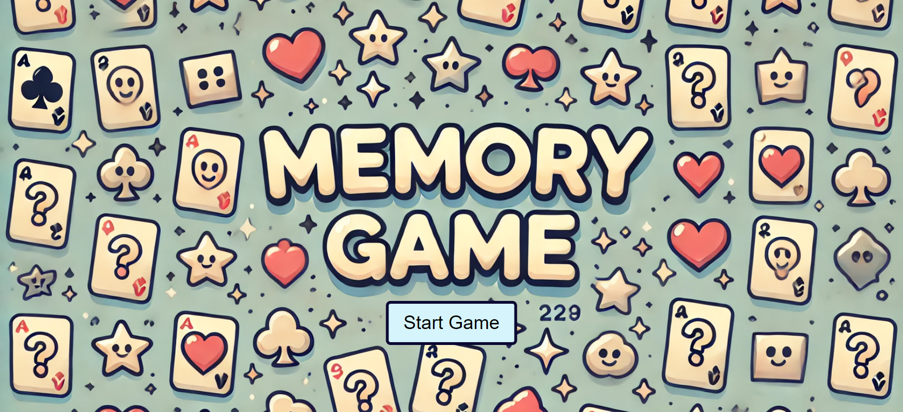
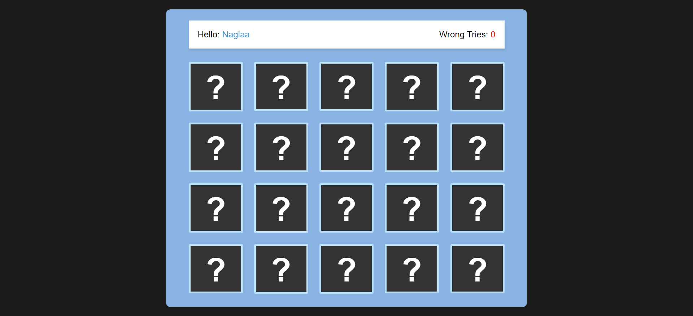
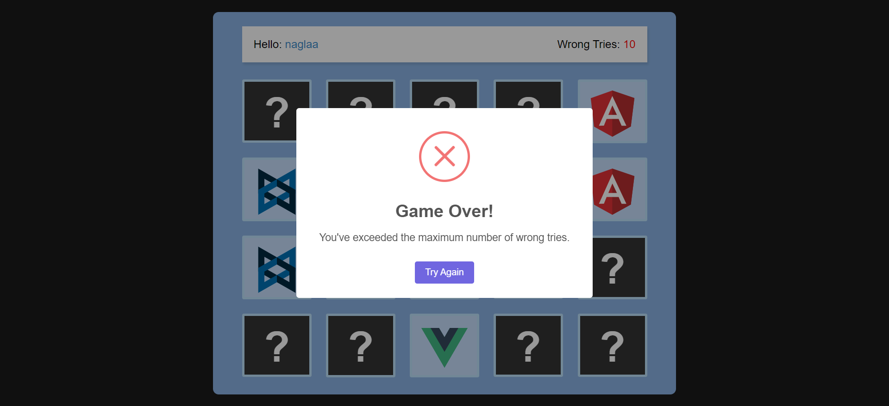
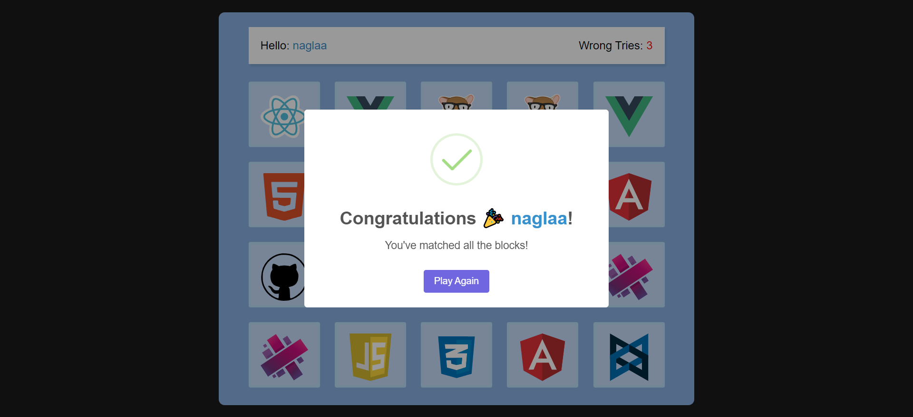

# Memory Game Project
This is a simple memory-matching game built using HTML, CSS, and JavaScript. The objective of the game is to match all pairs of blocks with as few wrong tries as possible. The game includes a countdown for flipping all blocks at the start, a prompt for the player's name, and dynamic feedback during gameplay.

## Features

- Interactive Gameplay: Flip two blocks at a time to find matching pairs.
- Player Prompt: The game asks for the player's name at the start and displays it throughout the game.
- Victory Condition: When all pairs are matched, the player is congratulated with a SweetAlert, 
  showing their name in a customized color.
- Failure Condition: The game ends when the player exceeds the maximum number of wrong 
  tries and displays a "Game Over" message.
- Sound Effects: Success and failure sounds for matched and unmatched blocks.
- Shuffle: The blocks are shuffled randomly at the start of every game.

## Game Flow

- Start Game: The player clicks the "Start" button, enters their name, and all blocks are
  temporarily revealed for 3 seconds.
- Gameplay: The player clicks on blocks to flip them. If two flipped blocks match, 
  they remain revealed. If they don’t, they are flipped back after a brief delay.
- Victory: Once all pairs are matched, the game congratulates the player by name using
  a SweetAlert modal.
- Failure: If the player exceeds the allowed number of wrong tries, the game displays a
  "Game Over" SweetAlert modal.
- Play Again: The game provides a "Play Again" option after either winning or losing

## preview

# Live Demo :
[]
